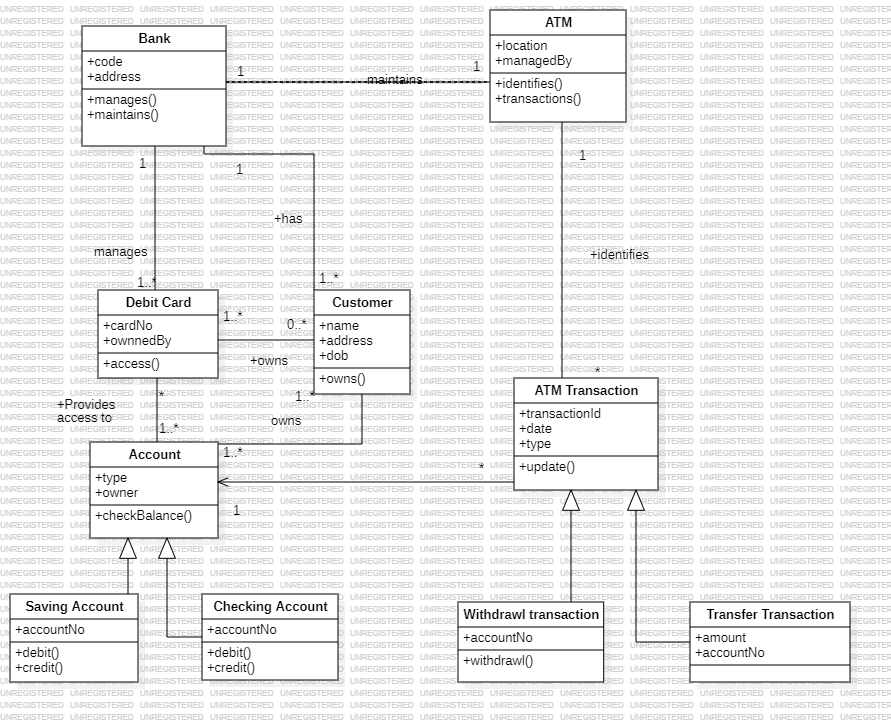
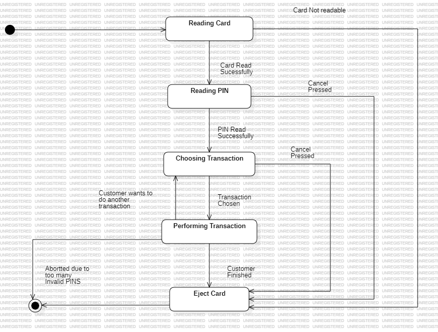

# Passport Management System

An automated system designed to streamline and manage the passport application, verification, approval, and issuance processes. This repository contains the source code along with the **StarUML architectural and design diagrams** detailing the system's blueprint.

## 🚀 Key Features
* **User Registration & Login:** Secure authentication for applicants and administrators.
* **Online Application:** Electronic form submission for new passports and renewals.
* **Document Verification:** Administrative portal to review, approve, or reject uploaded documents.
* **Status Tracking:** Real-time tracking system for applicants to view their application progress.
* **Appointment Scheduling:** Integrated system to book slots for physical biometric verification.

---

## 📊 System Architecture & Diagrams (StarUML)

Below are the architectural models and design diagrams created using StarUML to represent the system design.

### 1. Use Case Diagram
*Describes the functional requirements of the system and how different actors (Applicant, Admin, Passport Officer) interact with it.*

### 2. Class Diagram
*Shows the object-oriented structure of the system, including classes, attributes, methods, and relationships.*

### 3. Sequence Diagram
*Illustrates the chronological interaction and message flow between objects during the application process.*

### 4. Entity-Relationship Diagram (ERD)
*Maps out the database schema, showing tables like Users, Applications, Documents, and Appointments.*

---

## 🛠️ Technologies Used
* **Modeling Tool:** StarUML
* **Frontend:** [e.g., HTML5, CSS3, JavaScript / React]
* **Backend:** [e.g., Node.js / Python / Java]
* **Database:** [e.g., MySQL / PostgreSQL / MongoDB]

## 📁 How to View the Diagrams
1. **As Images:** You can view the exported `.png` or `.jpeg` files directly above in this README or inside the `diagrams/` folder.
2. **In StarUML:** Download the source file (e.g., `passport_management.mdj`) from this repository and open it using the **StarUML** desktop application.
